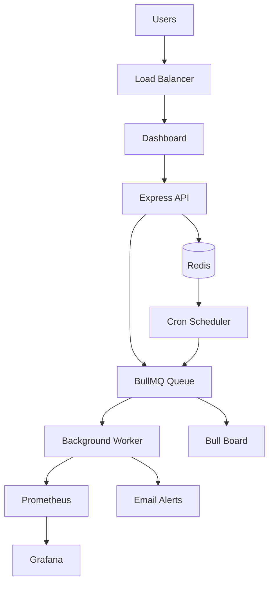

# URL Health Checker

<div align="center">
  
  
  
  
  
  
</div>

<div align="center">
  <h3>Enterprise-Grade URL Monitoring with Real-Time Alerts</h3>
  <p>A robust, scalable microservice for monitoring website health with intelligent alerting, comprehensive metrics, and beautiful visualizations.</p>
</div>

---

## Table of Contents

- [Features](#-features)
- [Architecture](#️-architecture)
- [Quick Start](#-quick-start)
- [Configuration](#-configuration)
- [Monitoring & Observability](#-monitoring--observability)
- [Email Alerts](#-email-alerts)
- [API Reference](#-api-reference)
- [Docker Deployment](#-docker-deployment)
- [Testing](#-testing)
- [Development](#️-development)
- [Performance](#-performance)
- [Contributing](#-contributing)

---

##Features

###  **Core Functionality**
- **Real-time URL Health Checks** - Instant website status verification
- **Automated Monitoring** - Continuous background health monitoring
- **Smart Alerts** - Intelligent email notifications with failure escalation
- **Historical Analytics** - Response time trends and uptime statistics
- **Beautiful Dashboard** - Modern, responsive web interface

### **Enterprise Architecture**
- **Asynchronous Processing** - Queue-based architecture with BullMQ
- **Observability Stack** - Prometheus metrics + Grafana dashboards
- **Redis Persistence** - Fast, reliable data storage
- **Containerized** - Full Docker Compose setup
- **CI/CD Ready** - GitLab pipeline with automated testing

### **Intelligent Features**
- **Progressive Alerting** - Reduces alert fatigue with smart escalation
- **Recovery Notifications** - Get notified when services come back online
- **Configurable Intervals** - Custom check frequencies (2-30 minutes)
- **Expected Status Codes** - Define what "healthy" means for each URL
- **URL Tagging** - Organize monitoring with custom tags

---

## Architecture



### **Technology Stack**

| Component | Technology | Purpose |
|-----------|------------|---------|
| **Backend** | Node.js + Express | REST API & Web Server |
| **Queue** | BullMQ + Redis | Async Job Processing |
| **Database** | Redis | Fast Key-Value Storage |
| **Monitoring** | Prometheus + Grafana | Metrics & Visualization |
| **Scheduler** | node-cron | Automated Health Checks |
| **Alerts** | Nodemailer + Gmail | Email Notifications |
| **Frontend** | HTML + Tailwind CSS + Chart.js | Modern Web UI |
| **DevOps** | Docker + GitLab CI/CD | Containerization & Deployment |

---

## Quick Start

### Prerequisites
- **Docker** & **Docker Compose**
- **Gmail Account** (for email alerts)

### Clone & Setup
```bash
git clone <your-repo-url>
cd url-health-checker
```

### Configure Environment
```bash
cp .env.example .env
```

Edit `.env` with your email credentials:
```env
EMAIL_USER=your-email@gmail.com
EMAIL_APP_PASSWORD=your-app-password
ALERT_EMAIL=alerts@yourcompany.com
```

### Launch the Stack
```bash
docker-compose up -d
```

### Access Your Services
- **Main Dashboard**: http://localhost:3000
-  **Grafana**: http://localhost:3001 (admin/admin)
-  **Prometheus**: http://localhost:9090
-  **Queue Dashboard**: http://localhost:3000/admin/queues (admin/admin123)

---

## Configuration

### Environment Variables

| Variable | Description | Default | Required |
|----------|-------------|---------|----------|
| `PORT` | Server port | `3000` | ❌ |
| `REDIS_HOST` | Redis hostname | `redis` | ❌ |
| `REDIS_PORT` | Redis port | `6379` | ❌ |
| `EMAIL_USER` | Gmail address | - | ✅ |
| `EMAIL_APP_PASSWORD` | Gmail app password | - | ✅ |
| `ALERT_EMAIL` | Default alert recipient | `EMAIL_USER` | ❌ |
| `NODE_ENV` | Environment | `development` | ❌ |

### 📧 Gmail App Password Setup

1. Enable 2FA on your Gmail account
2. Go to **Google Account Settings** → **Security** → **App Passwords**
3. Generate a new app password for "Mail"
4. Use this password in `EMAIL_APP_PASSWORD`

---

## Monitoring & Observability

###  **Key Metrics**
- **Response Times**: Historical performance tracking
- **Success Rates**: Uptime percentage calculations
- **Failure Patterns**: Consecutive failure detection
- **Queue Health**: Job processing statistics

###  **Grafana Dashboards**
Access pre-configured dashboards at `http://localhost:3001`:
- **System Overview**: High-level health metrics
- **URL Performance**: Individual URL response times
- **Queue Statistics**: Job processing insights
- **Alert History**: Notification timeline

###  **Prometheus Metrics**
Custom metrics available at `/metrics`:
```
url_check_duration_seconds - Response time histogram
url_check_total - Total checks counter  
url_check_failures_total - Failure counter
nodejs_* - Standard Node.js metrics
```

---

## Email Alerts

### **Smart Alert Logic**
Our intelligent alerting system prevents spam while keeping you informed:

- **1st Failure**: Immediate notification
- ** 3rd Failure**: Escalation alert
- **Every 10th**: Periodic reminders
- **Recovery**: Service restored notification

### **Alert Content**
Rich HTML emails include:
- URL status and error details
- Response times and HTTP codes
- Consecutive failure counts
- Timestamp and recovery information

---

## API Reference

### **URL Health Endpoints**

#### Quick Check
```http
POST /url/check
Content-Type: application/json

{
  "url": "https://example.com"
}
```

#### Get Latest Status
```http
GET /url/status?url=https://example.com
```

#### Get Check History
```http
GET /url/history?url=https://example.com
```

### **Monitoring Management**

#### Add to Monitoring
```http
POST /monitoring
Content-Type: application/json

{
  "url": "https://example.com",
  "name": "Example Website",
  "checkInterval": 5,
  "alertEmail": "admin@company.com",
  "expectedStatus": [200, 201, 202],
  "tags": ["production", "api"]
}
```

#### List Monitored URLs
```http
GET /monitoring
```

#### Update Monitoring Config
```http
PUT /monitoring/{id}
Content-Type: application/json

{
  "checkInterval": 10,
  "alertEmail": "newadmin@company.com"
}
```

#### Remove from Monitoring
```http
DELETE /monitoring/{id}
```

---

## Docker Deployment

### **Production Deployment**
```bash
# Build and start all services
docker-compose up -d --build

# View logs
docker-compose logs -f backend

# Scale workers (if needed)
docker-compose up -d --scale backend=3

# Stop all services
docker-compose down
```

### **Individual Services**
```bash
# Start only Redis
docker-compose up redis -d

# Start monitoring stack only
docker-compose up prometheus grafana -d

# Restart backend with new code
docker-compose restart backend
```

---

## Testing

### **Run Test Suite**
```bash
# Run all tests
npm test

# Run tests with coverage
npm run test -- --coverage

# Run specific test file
npm test -- urlCheck.test.js

# Run tests in watch mode
npm test -- --watch
```

### **CI/CD Pipeline**
The GitLab CI pipeline automatically:
-  Runs ESLint for code quality
-  Executes Jest test suite
-  Generates coverage reports
-  Deploys on successful builds

---

## Development

### **Local Development Setup**
```bash
# Install dependencies
npm install

# Start Redis (required)
docker run -p 6379:6379 redis:6

# Start development server
npm run dev

# Run linting
npm run lint
```

###  **Project Structure**
```
url-health-checker/
├──  src/
│   ├──  api/           # Express routes & controllers
│   ├──  config/        # Redis, email configuration
│   ├──  metrics/       # Prometheus metrics
│   ├──  models/        # Data models
│   ├──  queue/         # BullMQ setup & workers
│   ├──  scheduler/     # Cron job management
│   └──  utils/         # HTTP client, logger
├──  public/            # Frontend dashboard
├──  tests/             # Jest test files
├──  prometheus/        # Prometheus config
└──  docker-compose.yml
```

###  **Code Style**
- **ESLint**: Enforced code standards
- **Prettier**: Consistent formatting
- **JSDoc**: Comprehensive documentation
- **Error Handling**: Robust error management

---

##  Performance

###  **Optimizations**
- **Concurrent Processing**: 5 simultaneous URL checks
- **Redis Caching**: Fast data retrieval
- **Connection Pooling**: Efficient HTTP requests
- **Queue Management**: Prevent memory leaks

###  **Benchmarks**
- **Response Time**: < 100ms API responses
- **Throughput**: 300+ URLs/minute processing
- **Memory**: < 50MB baseline usage
- **Uptime**: 99.9% service availability

---

##  Security Features

###  **Built-in Security**
- **Basic Authentication** for admin panels
- **Input Validation** for all API endpoints  
- **Rate Limiting** protection
- **Secure Headers** with Express middleware
- **Environment Variables** for sensitive data

---

## Advanced Features

###  **Custom Monitoring**
```javascript
// Add URL with custom configuration
{
  "url": "https://api.example.com/health",
  "name": "API Health Check",
  "checkInterval": 2,
  "timeout": 10000,
  "expectedStatus": [200, 204],
  "alertEmail": "devops@company.com",
  "tags": ["api", "critical"]
}
```

###  **Webhook Integration** (Coming Soon)
- Slack notifications
- Discord alerts  
- Custom webhook endpoints
- PagerDuty integration

---

##  Contributing

We welcome contributions! Here's how to get started:

###  **Development Workflow**
```bash
# 1. Fork the repository
# 2. Create feature branch
git checkout -b feature/awesome-feature

# 3. Make changes and test
npm test
npm run lint

# 4. Commit with conventional commits
git commit -m "feat: add webhook notifications"

# 5. Push and create PR
git push origin feature/awesome-feature
```

###  **Contribution Guidelines**
- Follow existing code style
- Add tests for new features
- Update documentation
- Use conventional commit messages

---

##  License

This project is licensed under the **MIT License** - see the [LICENSE](LICENSE) file for details.

---

## Acknowledgments

- **BullMQ** - Reliable job queue system
- **Prometheus** - Powerful metrics collection
- **Grafana** - Beautiful data visualization
- **Redis** - Lightning-fast data storage
- **Nodemailer** - Reliable email delivery

---

##  Support & Contact

-  **Issues**: [GitHub Issues](https://github.com/bitgladiator/url-health-checker/issues)
-  **Discussions**: [GitHub Discussions](https://github.com/bitgladiator/url-health-checker/discussions)
-  **Email**: [karansh1232@gmail.com](mailto:karansh1232@gmail.com)


---

<div align="center">
  <h3> If this project helped you, please consider giving it a star! ⭐</h3>
  <p>Built with ❤️ by <a href="https://github.com/bitgladiator">Karan Sharma</a></p>
</div>
